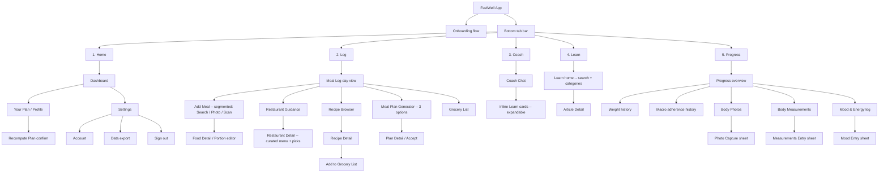

# FuelWell — App Map (Phase 0.5 · Step 1)

**Status:** DRAFT — synthesized from locked Pilot scope (gap analysis 2026-05-13). Max's Execution Blueprint is not in the repo; reconcile screen numbering with Max before locking.

**Purpose:** one-page sitemap showing every screen in the Pilot app, parent/child relationships, and the onboarding entry sequence. No navigation arrows yet (that's Step 2 — Flow Chart). No layout opinions yet (that's Step 3 — Wireframes).

**Root principle (PRINCIPLES.md):** Dashboard is the root. Every other screen exists to serve the Daily Loop — *Dashboard → Log → Adjust → Continue → Repeat*.

---

## 1. Entry sequence — Onboarding (pre-tab)

Runs once per user, ahead of the tab bar. Output: a profile, baseline macros, and a first plan.

```
Welcome
  → Sign in / Sign up        (Apple Sign-In + email/password)
    → Goal selection         (lose / maintain / gain / recomp-deferred)
      → Body baseline        (height, weight, age, sex, activity)
        → Dietary constraints (allergies, preferences, dislikes)
          → HealthKit permission prompt   (read-only: weight, steps, workouts, active energy)
            → Notification permission prompt (event-driven coaching)
              → "Your Plan" reveal        (computed macros + why-this-plan explainer)
                → Dashboard (Daily Loop starts)
```

---

## 2. Main app — bottom tab bar (5 tabs)



---

## 3. Screen inventory (target reconciliation: ~13 top-level)

Grouping sub-sheets under their parent screen brings the count to roughly 13 top-level "real screens" the user navigates between. Modals/sheets (capture, entry, confirm) are not counted as standalone screens.

| # | Top-level screen | Tab | Notes |
|---|---|---|---|
| 1 | Dashboard | Home | Root of Daily Loop. Verdict-first. |
| 2 | Your Plan / Profile | Home | Includes "why this plan" + manual recalc trigger |
| 3 | Settings | Home | Account, export, sign-out, notification prefs |
| 4 | Meal Log (day view) | Log | Day's entries + add affordance |
| 5 | Add Meal (Search / Photo / Scan) | Log | Single screen, three input modes via segmented control |
| 6 | Restaurant Guidance | Log | Curated DB of top chains |
| 7 | Recipe Browser + Detail | Log | "What should I cook tonight" given remaining macros |
| 8 | Meal Plan Generator | Log | Three options per generation |
| 9 | Grocery List | Log | Auto from recipes + manual additions |
| 10 | Coach Chat | Coach | AI conversation with inline Learn cards |
| 11 | Learn (search + categories) | Learn | Browseable education + Article Detail |
| 12 | Progress overview | Progress | Weight, macros, photos, measurements, mood — combined dashboard |
| 13 | Onboarding flow | (pre-tab) | Sign-in through Plan reveal, runs once |

**Sheets / modals (not counted as screens):** Food Detail editor, Recipe → Grocery confirm, Photo Capture, Measurements Entry, Mood Entry, Recompute Plan confirm, permission prompts.

---

## 4. Open questions for Max

Items where my draft is a guess and Max's call should win:

1. **Where does "Meal Plan Generator" live?** I put it under the Log tab. Could equally hang off Dashboard or be its own modal flow.
2. **Restaurant Guidance under Log vs. Coach?** I chose Log (it's a decision tool tied to "what am I about to eat?"). Argument for Coach: it's a conversational "help me decide" surface.
3. **Recipe Browser as a Log child vs. Learn child?** I put it under Log because recipes are decision support for meals. Could move to Learn.
4. **Should "Your Plan" be its own tab?** I made it a Home child to avoid a 6th tab; iOS HIG strongly prefers ≤ 5 tabs.
5. **Onboarding intake form** — does Max's existing intake form match the 6-step flow I drafted, or does he have a different sequence?
6. **Is there a 13th top-level screen I missed?** My inventory has 13 including onboarding-as-flow. Max's blueprint may count differently (e.g. counting each onboarding step as a screen, which would land closer to 18–20).

---

## 5. Gate criteria

Before moving to Step 2 (Flow Chart), this document needs:
- [ ] Max review and reconciliation against the Execution Blueprint screen numbering
- [ ] Robert + Max agreement on the 6 open questions above
- [ ] Sign-off recorded in `docs/ios-guide/decisions.md`

---

*Output of Phase 0.5 · Step 1. Next: Step 2 — Flow Chart (same screens, with navigation arrows and per-button behavior).*
