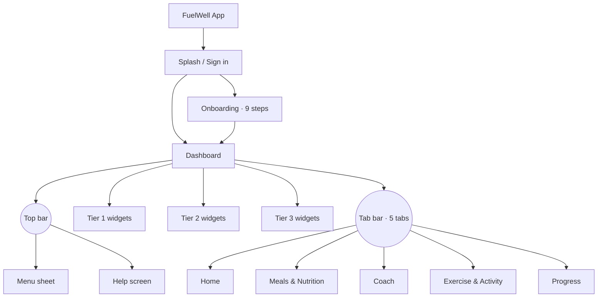

# FuelWell — App Map v2 (Phase 0.5 · Step 1)

**Status:** ✅ APPROVED v2 — Robert reorganized the IA 2026-05-19 after the Round 1 mockup review. Max's Step 2 blockers resolved. All 27 Round 1 mockups stay; they're re-homed in the new tab/menu structure.

**What changed from v1 → v2:**
- Tab bar: `Home · Log · Coach · Learn · Progress` → **`Home · Meals/Nutrition · Coach · Exercise & Activity · Progress`**
- Coach is the centerpiece tab — visually distinct (speech-bubble icon, inverted shading)
- "Learn" tab dissolved into the new **Help** screen, accessed from the Dashboard top bar
- New top-level navigation surface: a **hierarchical Menu** (Tools / Coach / Settings / Help / About)
- Dashboard adopts **Max's Tier 1/2/3 framework** — max 3 elements above the fold
- New Dashboard widget: **Inflows/Outflows** (dual concentric ring with day/week/month/year toggle)
- New per-tab landing pages: **Meals/Nutrition hub** and **Exercise & Activity hub** (the old "Meal Log day view" and "Workout Detail" are sub-pages under these)
- Nothing is deleted — every Round 1 screen has a new home

**Root principle (PRINCIPLES.md):** Dashboard is the root. Every other screen exists to serve the Daily Loop — *Dashboard → Log → Adjust → Continue → Repeat*.

---

## 1. Entry sequence — Onboarding (pre-tab)

Unchanged from v1. Nine sequential steps; runs once per user.

```
FuelWell (splash)
  → Sign in / Register
      ├── First-time → Onboarding → existing 9-step flow
      │     1. Welcome
      │     2. Sign in / Sign up
      │     3. Goal selection
      │     4. Body baseline
      │     5. Dietary constraints
      │     6. Lifestyle
      │     7. HealthKit permission
      │     8. Notification permission
      │     9. Your Plan reveal
      │       → Dashboard (Daily Loop starts)
      └── Returning → Dashboard direct
```

---

## 2. Tab bar — five tabs, Coach centered

| Order | Tab | Visual treatment | Tier |
|---|---|---|---|
| 1 (leftmost) | Home | Standard SF Symbol `house.fill` | Outer |
| 2 | Meals & Nutrition | Standard SF Symbol `fork.knife` | Second |
| 3 (center, prominent) | **Coach** | **Speech-bubble icon, inverted (`bg.elevated #0F1117`) container, slight elevation** | Centerpiece |
| 4 | Exercise & Activity | Standard SF Symbol `figure.run` | Second |
| 5 (rightmost) | Progress | Standard SF Symbol `chart.line.uptrend.xyaxis` | Outer |

The Coach tab is always visually distinct, even when inactive. The rest follow iOS standard active/inactive coloring.



---

## 3. Dashboard — Tier 1/2/3 framework (Max's blocker resolved)

The Home tab root. Top bar carries Menu (left) and Help (right). Max's hard ceiling: **maximum 3 visual units above the fold.**

### Tier 1 — always above fold

| Element | Why Tier 1 |
|---|---|
| **Health Score hero** | Single most important signal of how the user is doing. Includes 30-day delta and "Why?" expander. |
| **Inflows/Outflows widget** (dual concentric ring) | Creative energy-balance visual. Outer ring = calories in by macro; inner ring = calories out by source (BMR / activity / workout). Center = net. Toggles day/week/month/year. |
| **Verdict-of-the-moment CTA** | One-line "what should I do right now" with a primary action. The Daily Loop's entry point. |

### Tier 2 — visible on first scroll

- Activity overview card (workouts logged, active minutes, calories burned, mini weekly bar)
- Nutrition/Meals overview card (today's meals snapshot, remaining macros bar)
- My day / week / month view (segmented timeline of intake vs. expenditure over the chosen window)

### Tier 3 — progressive disclosure (deeper scroll or expanded states)

- Progress overview summary (sparkline + trend line)
- Daily Recap card (appears only after 8pm — also triggered as a push and accessible from the Menu)
- Coach nudge card (event-driven — appears only when a trigger fires; otherwise hidden)

**Habit Tracking is NOT on the Dashboard** in v2. It lives in the Progress tab and in the Menu under Tools › Tracking.

---

## 4. Menu — hierarchical navigation (new in v2)

Opened from the hamburger icon top-left of Dashboard (and any screen via the universal Menu icon). Full-screen sheet with grouped sections.

```
USER HEADER (avatar · name · goal pill · today's Health Score)

TOOLS
├── Snapshot
│   ├── Health Score
│   ├── Daily Recap
│   ├── Inflows / Outflows
│   └── My day · week · month
├── Tracking
│   ├── Habits
│   ├── Weight history
│   ├── Body photos
│   ├── Measurements
│   └── Mood & energy
├── Meals
│   ├── Meal Log
│   ├── Recipe Browser
│   ├── Meal Plan Generator
│   ├── Grocery List
│   ├── Restaurant Guidance
│   └── Macro history
└── Training
    ├── Workout Log
    ├── Activity Tracker
    ├── Workout Plans
    ├── Exercise Library
    └── Schedule

COACH
└── Coach Chat (link)

SETTINGS
├── Account
├── Permissions
├── Notification preferences
├── Data export
└── Sign out (destructive)

HELP
├── Learn articles (search + categories)
├── Contact support
└── Send feedback

ABOUT
├── About FuelWell
├── Privacy
├── Terms
├── Share FuelWell
└── Version
```

---

## 5. Help screen — replaces the v1 Learn tab

Accessed from the Help icon top-right of Dashboard. Single screen that combines:

- **Search bar** — "Search articles, settings, or ask a question"
- **Featured article today** — hero card with image, 3-min read pill
- **Categories** — Nutrition basics · Macros explained · Eating out · Recovery · Training fundamentals · Sleep & energy · Mindset
- **Continue reading** — articles started but not finished
- **Quick settings** — Notifications, HealthKit, Account, plus "All settings →"
- **Talk to coach** — small card linking to Coach Chat
- **Send feedback** — text-link

Article tone (carried over from v1 Learn): ≤3-minute reads, smart-friend voice, every article ends with a "One thing to try today" actionable takeaway card.

---

## 6. Tab landings (new in v2)

Each non-Home tab opens a **hub landing page** that surfaces sub-pages, not a single screen.

### 6.1 Meals & Nutrition tab landing

| Section | Content |
|---|---|
| Hero | Today's plate — compact Inflows/Outflows ring + remaining macros bar |
| Today's meals | Logged meal rows + pending dinner slot |
| Quick access | Meal Log · Restaurant Guidance · Recipe Browser · Meal Plan Generator · Grocery List · Macro History |
| Recent foods | Horizontal scroll of recent meal chips for one-tap re-log |

### 6.2 Exercise & Activity tab landing

| Section | Content |
|---|---|
| Hero | Today's workout card OR Rest day card |
| This week | Day chips with workout/rest indicators and minutes |
| Quick access | Workout Log · Activity Tracker · Workout Plans · Exercise Library · Schedule · Trainer workouts (manual entry) |
| Recent workouts | Last 3 logged workouts |

### 6.3 Progress tab landing (v2)

Default time range: weekly.

| Section | Content |
|---|---|
| Health Score trend | Current score + 30-day delta + sparkline. Tap → Health Score detail. |
| Weight | Line chart of weekly averages + "Add weight" |
| Macro adherence | Weekly bar chart + summary |
| Body photos | Horizontal scroll + "Add photo" |
| Measurements | List with weekly trend arrows |
| Mood & energy | Weekly average + small heatmap |
| Habit Tracking | Compact dot grid (last 14 days × 4 habits) + "View all habits" link |

### 6.4 Coach tab

Coach Chat. Inline Learn cards expand within the chat (the article surface remains in Help, but contextual cards are also surfaced inline).

---

## 7. Screen inventory v2 — 30 top-level screens (17 from v1 re-homed + 13 new/elevated)

**New in v2** marked with ⭐. **Re-homed from v1** marked with ↻.

### Home tab

| # | Screen | Notes |
|---|---|---|
| 1 | Dashboard v2 ⭐ | Tier 1/2/3 layout per Max |
| 2 | Daily Recap / Coach Summary ↻ | Reachable from Dashboard card, 8pm push, and Menu |
| 3 | Your Plan / Profile ↻ | Recalc confirm modal |
| 4 | Settings ↻ | Reachable from Menu and Help |
| 5 | Menu (hierarchical sheet) ⭐ | New navigation surface |
| 6 | Help screen ⭐ | Replaces v1 Learn tab |
| 7 | Inflows/Outflows full screen ⭐ | Sankey-style flow diagram, daily/weekly/monthly/yearly |
| 8 | Health Score detail ↻ | Composite breakdown |
| 9 | Habit Tracking detail ↻ | Reached from Menu and Progress |

### Meals & Nutrition tab

| # | Screen | Notes |
|---|---|---|
| 10 | Meals & Nutrition hub ⭐ | Tab landing |
| 11 | Meal Log day view ↻ | Persistent floating add button |
| 12 | Add Meal sheet ↻ | Photo default |
| 13 | Food Detail / Portion editor ↻ | Sheet |
| 14 | Restaurant Guidance ↻ | Curated chain DB |
| 15 | Restaurant Detail ↻ | Coach picks at top |
| 16 | Recipe Browser ↻ | Leads with remaining-macros section |
| 17 | Recipe Detail ↻ | Add to Grocery / Log as meal |
| 18 | Meal Plan Generator ↻ | Three options, single-line summaries |
| 19 | Grocery List ↻ | Grouped by category |
| 20 | Macro History ⭐ | Detail charts for macro adherence |

### Coach tab

| # | Screen | Notes |
|---|---|---|
| 21 | Coach Chat ↻ | Soul of the app, "Ask me anything about today…" placeholder |
| 22 | Article Detail ↻ | Reachable from Help and inline from Coach Chat |

### Exercise & Activity tab

| # | Screen | Notes |
|---|---|---|
| 23 | Exercise & Activity hub ⭐ | Tab landing |
| 24 | Workout Detail ↻ | Active session: pre-workout + in-progress + summary |
| 25 | Workout Log ⭐ | History view of past workouts |
| 26 | Activity Tracker ⭐ | Passive activity from Apple Health |
| 27 | Workout Plans ⭐ | Library / templates |
| 28 | Exercise Library ⭐ | Searchable exercise reference |
| 29 | Schedule ⭐ | Week / month view of planned workouts |

### Progress tab

| # | Screen | Notes |
|---|---|---|
| 30 | Progress overview v2 ↻ | Weekly default; surfaces Health Score, weight, macros, photos, measurements, mood, habits |

**Sheets / modals (not counted as screens):** Food Detail editor, Recipe → Grocery confirm, Photo Capture, Measurements Entry, Mood Entry, Recompute Plan confirm, Workout Set Logger, Habit Toggle, permission prompts, Inflows/Outflows lane drill-down sheets.

**Anti-pattern reminder (DESIGN.md):** no celebratory streak chips, badges, or gamification. The Habit grid is a *visualization*, not a reward. The Health Score is a *diagnostic*, not a score-to-beat.

---

## 8. Health Score v1 formula (Max's blocker resolved)

| Component | Weight | Source |
|---|---|---|
| Nutrition adherence | 35% | % of days within macro targets, rolling 7-day window |
| Training consistency | 25% | Workouts completed vs. planned, rolling 7-day window |
| Sleep | 20% | Average sleep duration + consistency, rolling 7-day window |
| Recovery (HRV / RHR) | 10% | HRV trend + resting HR vs. baseline, rolling 7-day window |
| Body comp trend | 10% | Weight + body fat % movement vs. goal direction |

- **Range:** 0–100
- **Missing components:** *excluded* — remaining components re-weighted proportionally. No penalty zeros.
- **Day-1 fallback:** display "Building your baseline — 7 days of data unlocks your Health Score" with a placeholder ring. No score number rendered.
- **Score is a diagnostic, not a competition.** No leaderboards, no "your friends scored X" comparisons, ever.

---

## 9. Empty states — required on every screen (Max's blocker resolved)

A thoughtful empty state is a brand moment, not a placeholder. Every screen below has an empty-state copy line in coach voice.

| Screen | Trigger | Empty-state copy |
|---|---|---|
| Dashboard | Day 1, no data | "Welcome — your day starts here. Log your first meal whenever you're ready." |
| Health Score | <7 days of data | "Building your baseline — 7 days of data unlocks your Health Score." |
| Inflows/Outflows | No meals or workouts logged today | "Log your first meal or workout to see your energy flow." |
| Meal Log | Day 1, no entries | "No meals logged yet. The fastest way is a photo — tap the + below." |
| Add Meal (Search) | No recent foods | "Start typing — we'll pull from your previous meals and the food database." |
| Recipe Browser (for-macros) | No saved recipes that fit today | "Nothing in your saved recipes fits today's remaining macros. Want a fresh meal plan, or browse all?" |
| Meal Plan | No plan generated this week | "Tell us your week. We'll generate three options." |
| Grocery List | Empty | "Your list is empty. Generate a meal plan or add items below." |
| Restaurant Guidance | No location granted | "We can show top picks anywhere — grant location to sort by what's nearby, or browse the curated chain list." |
| Coach Chat | First open | "Hi Robert. I'm here when you want a second opinion. What's on your mind?" |
| Help / Learn | No saved articles | "Browse by category, or search for a question. Every article ends with one thing you can try today." |
| Article Detail | Article unavailable | "We couldn't load this article. Try again, or browse another below." |
| Progress overview | <7 days of data | "Progress fills in as you log. Weight, photos, mood — one entry kicks it off." |
| Weight history | Empty | "Log a weight and we'll start your trend line." |
| Body photos | Empty | "Photos make recomposition real. Add one when you're ready." |
| Measurements | Empty | "Tape measurements catch what the scale misses." |
| Mood & energy | Empty | "How are you feeling? One tap and we start to see the patterns." |
| Habit Tracking | No habits chosen | "Pick 3 habits to start. Coach can suggest some." |
| Daily Recap | <1 full day of data | "Tomorrow's the start of your recap. The more you log, the smarter this gets." |
| Workout Detail | No workout planned today | "No workout planned today. Pick a template, or take a rest day." |
| Workout Log | No history | "Your first logged workout shows up here." |
| Activity Tracker | No Apple Health data | "Connect Apple Health to see your daily movement here." |
| Workout Plans | No saved plans | "Browse plans or build your own — coach can suggest one based on your goals." |
| Exercise Library | No favorites | "Tap an exercise for the form video and tip notes." |
| Schedule | Empty week | "Plan a workout to start your week." |
| Settings | n/a | n/a |

---

## 10. Daily Recap trigger (Max's blocker resolved)

- **Trigger time:** 8pm **local device time.**
- **Quiet hours:** 10pm–7am. 8pm clears the window by 2 hours.
- **Future-state inheritance:** if the user customizes their notification schedule in a future release, Daily Recap inherits that schedule.
- **Travel / timezone change:** trigger fires at 8pm in the new local time after the device switches zones. No retro-fire.

---

## 11. Status

- [x] Max review of v1 (2026-05-13)
- [x] App Map v2 reorganization (Robert, 2026-05-19)
- [x] All 5 of Max's Step 2 blockers resolved
- [ ] Round 2 mockups generated (Dashboard v2, Inflows/Outflows widget + full, Activity overview, Meals/Nutrition hub, Exercise & Activity hub, Progress v2, Menu, Help, Tab bar component)
- [ ] Combined review PDF compiled for final round
- [ ] Sign-off recorded in `decisions.md`

---

*Output of Phase 0.5 · Step 1 v2 — Updated 2026-05-19. Next: regenerate Step 2 (Flow Chart) and Step 4 (Mockups Round 2) against this IA.*
