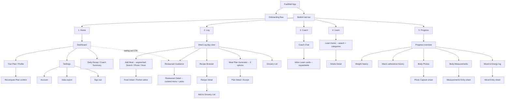

# FuelWell — App Map (Phase 0.5 · Step 1)

**Status:** ✅ APPROVED — Max reviewed and reconciled 2026-05-13. All 6 open questions resolved; one new screen added (Daily Recap, #14); one new onboarding step added (Lifestyle).

**Purpose:** one-page sitemap showing every screen in the Pilot app, parent/child relationships, and the onboarding entry sequence. No navigation arrows yet (that's Step 2 — Flow Chart). No layout opinions yet (that's Step 3 — Wireframes).

**Root principle (PRINCIPLES.md):** Dashboard is the root. Every other screen exists to serve the Daily Loop — *Dashboard → Log → Adjust → Continue → Repeat*.

---

## 1. Entry sequence — Onboarding (pre-tab)

Runs once per user, ahead of the tab bar. Output: a profile, baseline macros, and a first plan.

```
Welcome
  → Sign in / Sign up        (Apple Sign-In + email/password)
    → Goal selection         (lose / maintain / gain / recomp-deferred)
      → Body baseline        (height, weight, age, sex, activity)
        → Dietary constraints (allergies, preferences, dislikes)
          → Lifestyle             (cook at home / eat out mostly / both)   ← NEW per Max
            → HealthKit permission prompt   (read-only: weight, steps, workouts, active energy)
              → Notification permission prompt (event-driven coaching)
                → "Your Plan" reveal        (computed macros + why-this-plan explainer)
                  → Dashboard (Daily Loop starts)
```

The Lifestyle question immediately improves restaurant and recipe ranking. One tap, zero friction.

---

## 2. Main app — bottom tab bar (5 tabs)



---

## 3. Screen inventory (14 top-level)

Grouping sub-sheets under their parent screen. Modals/sheets (capture, entry, confirm) are not counted as standalone screens.

| # | Top-level screen | Tab | Notes |
|---|---|---|---|
| 1 | Dashboard | Home | Root of Daily Loop. Verdict-first. Above the fold: macro ring + next recommended meal + one coach nudge + mood/energy one-tap + **"I'm eating out right now" quick action**. |
| 2 | Your Plan / Profile | Home | Includes "why this plan" + manual recalc trigger (with confirm modal — Max wants intentional, slightly weighty feel). |
| 3 | Settings | Home | Account, export, sign-out, notification prefs. |
| 4 | Meal Log (day view) | Log | Day's entries + **persistent floating add button** (high frequency surface — must be fast). |
| 5 | Add Meal (Search / Photo / Scan) | Log | Three modes via segmented control. **Photo is the default tab** — most frictionless for real life. |
| 6 | Restaurant Guidance | Log | Curated DB of top chains. **Surfaceable from Dashboard in one tap.** Top 3 picks show macros immediately. |
| 7 | Recipe Browser + Detail | Log | **Leads with "based on your remaining macros today"** — not generic browse. |
| 8 | Meal Plan Generator | Log | Three options per generation; **each card has a single-line summary** (e.g. "Higher protein, lighter dinners"). |
| 9 | Grocery List | Log | Auto from recipes + manual additions. **Grouped by category** (produce, protein, pantry, etc.). |
| 10 | Coach Chat | Coach | AI conversation with inline Learn cards. Input placeholder: *"Ask me anything about today…"*. |
| 11 | Learn (search + categories) | Learn | Browseable education + Article Detail. **3-minute reads max; each article ends with one actionable takeaway**; smart-friend tone. |
| 12 | Progress overview | Progress | Weight, macros, photos, measurements, mood. **Default view: weekly, not daily.** |
| 13 | Onboarding flow | (pre-tab) | Welcome → Sign-in → Goal → Body → Dietary → **Lifestyle** → HealthKit → Notifications → Plan reveal. Runs once. |
| 14 | Daily Recap / Coach Summary | Home child | **NEW per Max.** What the coach noticed today; closes the loop on event-driven notifications. Triggered at 8pm and accessible from Dashboard. |

**Sheets / modals (not counted as screens):** Food Detail editor, Recipe → Grocery confirm, Photo Capture, Measurements Entry, Mood Entry, Recompute Plan confirm, permission prompts.

**Dashboard affordances (not standalone screens):**
- **"I'm eating out right now" quick action** — Dashboard CTA → Restaurant Guidance with today's remaining macros pre-loaded. The highest-frequency real-life moment FuelWell exists for. One tap.
- **Coach nudge card** — appears only when an event is triggered (skipped meal, off-target macros, etc.). Otherwise hidden.

**Every screen requires a thoughtful empty state.** Max calls these "brand moments" — empty Meal Log, no saved recipes, no progress data yet are all coaching opportunities, not blank lists.

---

## 4. Open questions — resolved by Max (2026-05-13)

| # | Question | Resolution |
|---|---|---|
| 1 | Where does Meal Plan Generator live? | **Log.** Food decision, not a coaching conversation. |
| 2 | Restaurant Guidance under Log vs. Coach? | **Log.** Standing-outside-restaurant moments need fast frictionless answers, not chat. Coach is for reflection. |
| 3 | Recipe Browser — Log or Learn? | **Log.** Recipes are decisional, not educational. |
| 4 | "Your Plan" as its own tab? | **No — Home child.** Reference material, not a daily visit. Respects iOS HIG ≤ 5 tabs. |
| 5 | Onboarding intake matches drafted 6-step? | **Yes, plus add Lifestyle step** (cook at home / eat out / both) after Dietary constraints. Improves restaurant + recipe ranking immediately. |
| 6 | Is there a 13th top-level screen missing? | **Yes — add Daily Recap / Coach Summary as #14.** Closes the loop on event-driven notifications by giving users a place to review what the coach noticed today. |

## 5. Per-screen modifications from Max's review

These don't change the screen list — they shape each screen's design and are inputs to Step 2 (Flow Chart) and Step 3 (Wireframes).

| Screen | Modification |
|---|---|
| **Onboarding** | "Your Plan" reveal should feel like a payoff, not a confirmation. Don't cut the why-this-plan explainer. Add Lifestyle step after Dietary. |
| **Dashboard** | All four essentials above the fold: macro ring, next recommended meal, one coach nudge if triggered, mood/energy one-tap. Add "I'm eating out right now" quick action that jumps to Restaurant Guidance with today's macros pre-loaded. |
| **Your Plan** | Recalculate My Plan needs a confirm modal — intentional, slightly weighty feel. |
| **Meal Log** | Persistent floating add button — opened multiple times per day, must be fast. |
| **Add Meal** | Photo mode is the **default tab**, not Search. |
| **Restaurant Guidance** | Surfaceable from Dashboard in one tap. Top 3 picks show macros immediately. Curated feel, not directory. |
| **Recipe Browser** | Leads with "based on your remaining macros today" — that's the differentiator. |
| **Meal Plan Generator** | Each option gets a single-line summary so users can choose without reading every macro. |
| **Grocery List** | Grouped by category (produce, protein, pantry). Clean and minimal, not spreadsheet. |
| **Coach Chat** | Soul of the app. Inline Learn cards expanding inside chat is the right pattern. Placeholder copy matters: *"Ask me anything about today…"*. |
| **Learn** | 3-minute reads max. Every article ends with one actionable takeaway. Smart-friend tone, never academic. |
| **Progress** | Default to **weekly view**, not daily. Daily fluctuations are noisy and discouraging. |

---

## 6. Status

- [x] Max review and reconciliation against the Execution Blueprint screen numbering (2026-05-13)
- [x] Robert + Max agreement on the 6 open questions
- [ ] Sign-off recorded in `docs/ios-guide/decisions.md`

---

*Output of Phase 0.5 · Step 1 — Approved 2026-05-13. Next: Step 2 — Flow Chart (updated with new screens + Max's per-screen modifications).*
