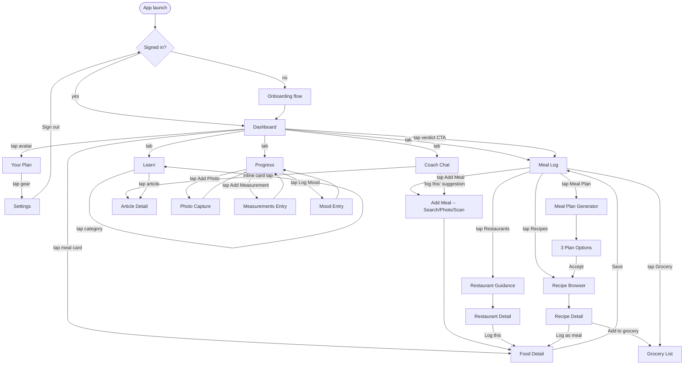
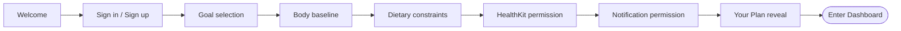

# FuelWell — Flow Chart (Phase 0.5 · Step 2)

**Status:** DRAFT — builds on the draft `APP-MAP.md`. If Max changes the App Map during reconciliation, this document needs to follow.

**Purpose:** every screen from the App Map, now with navigation arrows and per-button behavior. Still black-and-white, still no visual opinions. Answers the question: *"What happens when I tap this?"* for every interactive element on every screen.

**Format:** one Mermaid navigation diagram, then a per-screen button reference table.

---

## 1. Master navigation diagram

---

## 2. Onboarding flow (linear)

Each step has **Next** (advances) and **Back** (returns to previous). HealthKit and Notification prompts are skippable but log the skip for later prompting in-app.

---

## 3. Per-screen button reference

### 3.1 Dashboard (Home tab root)

| Element | Tap behavior |
|---|---|
| Verdict banner CTA (e.g. "Log lunch") | → Meal Log → Add Meal pre-routed to most-likely meal slot |
| Macro ring | → Progress tab, scrolled to today's macros |
| "Today's meals" card row | → Food Detail for the tapped meal |
| Quick-add (+) FAB | → Add Meal sheet |
| Avatar (top-right) | → Your Plan |
| Coach prompt card (if present) | → Coach Chat with prompt context preloaded |

### 3.2 Your Plan / Profile (Home child)

| Element | Tap behavior |
|---|---|
| "Why this plan" expander | Reveals reasoning inline |
| "Recalculate My Plan" button | → Recompute confirm sheet → recomputes macros |
| Edit goal | → Goal selection screen (single-step, returns here) |
| Edit body baseline | → Body baseline screen (returns here) |
| Settings gear (top-right) | → Settings |

### 3.3 Settings (Home child)

| Element | Tap behavior |
|---|---|
| Account | → Account detail (email, sign-in method) |
| Notification preferences | → Toggle list (quiet hours fixed 10pm–7am, individual trigger toggles) |
| HealthKit | → System permission sheet |
| Data export | → Email export confirm |
| Sign out | → Returns to AuthCheck → Welcome |

### 3.4 Meal Log day view (Log tab root)

| Element | Tap behavior |
|---|---|
| Day selector (today ± swipe) | Changes the day's entries |
| Meal row | → Food Detail (editable) |
| Add Meal button | → Add Meal sheet |
| Restaurants shortcut | → Restaurant Guidance |
| Recipes shortcut | → Recipe Browser |
| Meal Plan shortcut | → Meal Plan Generator |
| Grocery shortcut | → Grocery List |

### 3.5 Add Meal — Search / Photo / Scan (Log child)

| Element | Tap behavior |
|---|---|
| Segmented control | Switches input mode (Search / Photo / Scan) |
| Search result row | → Food Detail with portion editor |
| Photo capture button | Opens camera → AI parse → Food Detail with parsed items |
| Barcode scan | Opens camera in scan mode → resolves → Food Detail |
| Recent foods chip | One-tap log with last-used portion |

### 3.6 Food Detail / Portion editor (sheet)

| Element | Tap behavior |
|---|---|
| Portion stepper | Adjusts macros live |
| Meal slot selector | Breakfast / lunch / dinner / snack |
| Save | Persists meal → returns to caller (Log or Dashboard) |
| Delete (if editing existing) | Confirm → removes meal |

### 3.7 Restaurant Guidance (Log child)

| Element | Tap behavior |
|---|---|
| Search restaurant | Filters curated list |
| Restaurant row | → Restaurant Detail |
| Nearby toggle | (Pilot: location optional; if granted, sorts by distance) |

### 3.8 Restaurant Detail (Log child of child)

| Element | Tap behavior |
|---|---|
| Menu item row | Shows macros inline; tap chevron → Food Detail to log |
| "Coach pick" badge tap | Inline explanation of why this item fits remaining macros |
| Log this item | → Food Detail prefilled |

### 3.9 Recipe Browser (Log child)

| Element | Tap behavior |
|---|---|
| "Use remaining macros" toggle | Filters recipes to fit today's remaining budget |
| Category filter | Cuisine / time / difficulty |
| Recipe card | → Recipe Detail |

### 3.10 Recipe Detail (Log child of child)

| Element | Tap behavior |
|---|---|
| Add to Grocery List | Appends missing ingredients → returns with toast |
| Log as meal | → Food Detail with macros prefilled |
| Save to favorites | Toggles favorite state |

### 3.11 Meal Plan Generator (Log child)

| Element | Tap behavior |
|---|---|
| Generate button | Calls AI → returns three plan options |
| Plan option card (×3) | → Plan Detail |
| Accept this plan | Persists plan; auto-populates Grocery List; returns to Log |
| Regenerate | New three options (counts against AI cost) |

### 3.12 Grocery List (Log child)

| Element | Tap behavior |
|---|---|
| Checkbox | Marks item bought (struck through) |
| Item row long-press | Edit / delete |
| Add item (manual) | Inline text entry |
| Clear bought | Removes all checked items |
| Share | iOS share sheet (export as text) |

### 3.13 Coach Chat (Coach tab root)

| Element | Tap behavior |
|---|---|
| Message input + send | Standard chat send |
| Inline Learn card | Expands inline; "Read full article" → Article Detail |
| "Log this meal" suggestion chip | → Add Meal sheet with context preloaded |
| Voice input mic | Speech-to-text fills the input |
| New conversation | Archives current thread (still searchable) |

### 3.14 Learn home (Learn tab root)

| Element | Tap behavior |
|---|---|
| Search bar | Full-text search across articles |
| Category tile | Filters home view to that category |
| Article card | → Article Detail |
| Recently viewed row | → Article Detail |

### 3.15 Article Detail (Learn child)

| Element | Tap behavior |
|---|---|
| Back | → Previous screen (Learn or Coach) |
| Share | iOS share sheet |
| Save | Adds to "Saved articles" in Learn home |
| Related article tile (bottom) | → Article Detail (new) |

### 3.16 Progress overview (Progress tab root)

| Element | Tap behavior |
|---|---|
| Time range selector | 7d / 30d / 90d / all |
| Weight card | → Weight history full screen |
| Macro adherence card | → Macro history full screen |
| Add Photo button | → Photo Capture sheet |
| Add Measurement button | → Measurements Entry sheet |
| Log Mood button | → Mood Entry sheet |
| Photo grid thumbnail | → Photo viewer (swipe through history) |

### 3.17 Sheets (no screen-level navigation)

| Sheet | Buttons |
|---|---|
| Photo Capture | Camera / library picker, Save, Cancel |
| Measurements Entry | Numeric fields (waist, hips, chest, arms, thighs), Save, Cancel |
| Mood Entry | 1–5 scale for mood + energy, optional note, Save, Cancel |
| Recompute Plan confirm | "This will recalculate based on latest weight." Confirm / Cancel |

---

## 4. Cross-cutting interaction rules

These apply globally, not per screen:

| Rule | Behavior |
|---|---|
| **Back gesture** | Standard iOS swipe-from-left-edge available on every pushed screen |
| **Tab tap while on tab root** | Scrolls to top |
| **Tab tap on deep screen in same tab** | Pops to tab root |
| **Pull to refresh** | Available on Dashboard, Meal Log, Progress, Coach Chat |
| **Offline mode** | Read-only banner appears; write actions (Save / Log / Generate) disabled with explanatory toast |
| **Coach proactive push tap** | Deep-links to relevant screen (e.g. "skipped lunch?" → Add Meal pre-routed to lunch slot) |
| **Onboarding skip** | Available only on permission prompts (HealthKit, Notifications); not on data-entry steps |

---

## 5. Open questions / decisions deferred to Step 3

Things this flow chart cannot answer because they're layout/visual:

1. **Verdict placement on Dashboard** — above macros or below? *(Step 3 wireframe call.)*
2. **Meal Log: list vs. timeline vs. cards** — pure layout. *(Step 3.)*
3. **Coach Chat: bottom input or floating?** — *(Step 3.)*
4. **Progress: scroll-snap sections or scrollable single view?** — *(Step 3.)*
5. **Tab bar labels visible always, or icon-only with active label?** — *(Step 3.)*

Items that still need Max's product call:

6. **Does the verdict CTA on Dashboard pre-route to a meal slot, or open Add Meal generic?** (I drafted: pre-routed.)
7. **Does the meal plan auto-populate the grocery list on Accept, or prompt the user?** (I drafted: auto.)
8. **On sign-out, do we wipe local SQLiteData cache?** (I drafted: not specified — needs decision.)

---

## 6. Gate criteria

Before moving to Step 3 (Wireframes), this document needs:
- [ ] Max review of all navigation arrows and button behaviors
- [ ] Resolution of the 3 product questions in section 5
- [ ] Sign-off recorded in `docs/ios-guide/decisions.md`

---

*Output of Phase 0.5 · Step 2. Next: Step 3 — Wireframes (grayscale layouts for each screen).*
