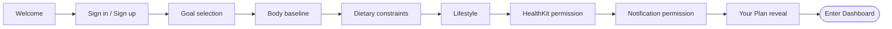

# FuelWell — Flow Chart v2 (Phase 0.5 · Step 2)

**Status:** ✅ UPDATED 2026-05-19 to App Map v2. Navigation arrows and per-button behavior across all 30 top-level screens (17 re-homed from v1 + 13 new/elevated).

**Purpose:** answers *"what happens when I tap this?"* for every interactive element on every screen. Still no visual opinions — that's Step 4 (Mockups).

**Format:** Mermaid navigation diagrams + per-screen button reference tables.

---

## 1. Master navigation diagram

```mermaid
flowchart TD
  Start([App launch])
  Start --> AuthCheck{Signed in?}
  AuthCheck -- no --> Onboard[Onboarding · 9 steps]
  AuthCheck -- yes --> Dash[Dashboard v2]
  Onboard --> Dash

  %% Top-bar affordances on Dashboard
  Dash -- hamburger --> Menu[Menu sheet]
  Dash -- help icon --> Help[Help screen]
  Help -- All settings --> Settings
  Help -- article tap --> Article[Article Detail]

  %% Tier 1/2/3 widget taps from Dashboard
  Dash -- HealthScore hero --> HSDetail[Health Score detail]
  Dash -- Inflows/Outflows widget --> IO[Inflows/Outflows fullscreen]
  Dash -- Verdict CTA --> AddMeal[Add Meal sheet]
  Dash -- Activity widget --> TExer
  Dash -- Nutrition widget --> TMeals
  Dash -- My day/week/month --> IO
  Dash -- Progress summary --> TProg
  Dash -- Daily Recap card --> Recap[Daily Recap]
  Dash -- 8pm push --> Recap
  Dash -- Coach nudge tap --> Coach

  %% Bottom tab bar — 5 tabs
  Dash --- TabBar((Tab bar))
  TabBar -- Home --> Dash
  TabBar -- Meals --> TMeals[Meals & Nutrition hub]
  TabBar -- Coach --> Coach[Coach Chat]
  TabBar -- Exercise --> TExer[Exercise & Activity hub]
  TabBar -- Progress --> TProg[Progress overview v2]

  %% Menu sheet outflows
  Menu -- Tools › any --> Tool[Tool screen]
  Menu -- Coach Chat --> Coach
  Menu -- Settings --> Settings
  Menu -- Help --> Help
  Menu -- About --> About

  %% Meals & Nutrition hub branches
  TMeals --> MealLog[Meal Log]
  TMeals --> Rest[Restaurant Guidance]
  TMeals --> Recipes[Recipe Browser]
  TMeals --> PlanGen[Meal Plan Generator]
  TMeals --> Grocery[Grocery List]
  TMeals --> MacroHist[Macro History]
  MealLog --> AddMeal
  AddMeal --> FoodDetail[Food Detail]
  FoodDetail -- Save --> MealLog
  Rest --> RestDetail[Restaurant Detail]
  RestDetail -- Log this --> FoodDetail
  Recipes --> RecipeDetail[Recipe Detail]
  RecipeDetail -- Add to grocery --> Grocery
  RecipeDetail -- Log as meal --> FoodDetail
  PlanGen --> PlanChoice[3 Plan Options]
  PlanChoice -- Accept --> Grocery

  %% Coach tab
  Coach -- inline Learn card --> Article
  Coach -- log this --> AddMeal

  %% Exercise & Activity hub branches
  TExer --> WorkoutDetail[Workout Detail]
  TExer --> WorkoutLog[Workout Log]
  TExer --> Activity[Activity Tracker]
  TExer --> Plans[Workout Plans]
  TExer --> ExLib[Exercise Library]
  TExer --> Schedule[Schedule]
  WorkoutDetail -- Start workout --> WorkoutActive[Active session]
  WorkoutActive --> WorkoutSummary[Workout summary]
  WorkoutSummary --> TExer

  %% Progress tab branches
  TProg --> HSDetail
  TProg --> Weight[Weight history]
  TProg --> Macro[Macro adherence]
  TProg --> Photos[Body photos]
  TProg --> Meas[Measurements]
  TProg --> Mood[Mood & energy]
  TProg --> Habits[Habit Tracking detail]
  Photos --> PhotoSheet[Photo Capture sheet]
  Meas --> MeasSheet[Measurements Entry sheet]
  Mood --> MoodSheet[Mood Entry sheet]
  PhotoSheet --> TProg
  MeasSheet --> TProg
  MoodSheet --> TProg

  %% Settings outflows
  Settings -- Sign out --> AuthCheck
```

---

## 2. Onboarding flow (linear, unchanged from v1)

Nine steps. Each has Next and Back. HealthKit and Notification prompts are skippable but log the skip for contextual re-prompt later.

---

## 3. Per-screen button reference

### 3.1 Dashboard v2 (Home tab root)

**Above-the-fold contract (Tier 1):** Health Score hero · Inflows/Outflows widget · Verdict-of-the-moment CTA. No other elements allowed above the fold.

**Top bar:**

| Element | Tap behavior |
|---|---|
| Hamburger (top-left) | → Menu sheet |
| Brand / FuelWell wordmark (center, optional) | Decorative |
| Help icon (top-right) | → Help screen |

**Tier 1 widgets (above fold):**

| Element | Tap behavior |
|---|---|
| Health Score hero (number + delta + sparkline) | → Health Score detail |
| Health Score "Why?" expander | Inline reveal of weighting and recent contributors |
| Inflows/Outflows dual-ring widget | → Inflows/Outflows full screen |
| Inflows/Outflows time-window pill (Today/Week/Month/Year) | Switches the widget's data window in place |
| Verdict-of-the-moment CTA (primary button) | → Add Meal sheet (Photo default), pre-routed to predicted meal slot OR → Workout Detail (if next move is training) |

**Tier 2 widgets (first scroll):**

| Element | Tap behavior |
|---|---|
| Activity overview card | → Exercise & Activity hub |
| Nutrition/Meals overview card | → Meals & Nutrition hub |
| My day / week / month view | → Inflows/Outflows full screen with matching window selected |

**Tier 3 widgets (progressive):**

| Element | Tap behavior |
|---|---|
| Progress overview summary | → Progress tab landing |
| Daily Recap card (after 8pm only) | → Daily Recap screen |
| Coach nudge card (event-driven) | → Coach Chat with prompt context preloaded |

### 3.2 Menu sheet (new)

Opened from the hamburger icon. Full-screen sheet. See APP-MAP § 4 for the full hierarchy.

| Element | Tap behavior |
|---|---|
| Close X | Dismiss sheet |
| User header (avatar + name) | → Your Plan / Profile |
| Today's Health Score chip (in header) | → Health Score detail |
| Any Tools row | → that screen (e.g. Tools › Snapshot › Health Score → Health Score detail) |
| Coach Chat row | → Coach Chat |
| Settings rows | → relevant Settings sub-screen |
| Help row | → Help screen |
| About row | → About screen (Privacy, Terms, Share, Version) |
| Sign out (destructive) | Confirm sheet → Sign out → AuthCheck → Welcome |

### 3.3 Help screen (new — replaces Learn tab)

| Element | Tap behavior |
|---|---|
| Back chevron | Returns to caller (Dashboard or Menu) |
| Search bar | Full-text search across articles, settings, FAQs |
| Featured article hero | → Article Detail |
| Category tile | Filters Help to that category |
| Continue-reading card | → Article Detail at saved scroll position |
| Quick settings row | → that specific settings sub-screen |
| "All settings →" link | → Settings (full) |
| Talk to coach card | → Coach Chat |
| Send feedback link | → mailto sheet |

### 3.4 Inflows/Outflows full screen (new)

| Element | Tap behavior |
|---|---|
| Back chevron | Returns to caller (Dashboard or My day view) |
| Time window segmented [Today/Week/Month/Year] | Re-renders the Sankey for that window |
| Sankey intake lane (e.g. "Lunch · 612 kcal") | → drill-down sheet with that meal's macros |
| Sankey expenditure lane (e.g. "Workout · 250 kcal") | → drill-down sheet with workout details |
| Info "i" icon | Inline explainer of the visualization |
| Detail rows below Sankey | → matching detail sheet |

### 3.5 Health Score detail (re-homed)

| Element | Tap behavior |
|---|---|
| Back chevron | Returns to caller |
| Hero (current score + 30-day delta + sparkline) | Decorative |
| Component card (Nutrition / Training / Sleep / Recovery / Body comp) | → that Progress section |
| "Why this score" expander | Coach-voice explainer of weights and recent contributors |
| Day-1 placeholder ("Building your baseline") | Decorative — no tap target |

### 3.6 Daily Recap (re-homed)

| Element | Tap behavior |
|---|---|
| Close X | Returns to caller (Dashboard or Menu) |
| Hero verdict | Decorative |
| Highlight rows (macro / sleep / mood / training / weight) | Tap → relevant Progress section |
| Tomorrow card | Decorative |
| "Reply to coach" button | → Coach Chat with recap context preloaded |

### 3.7 Your Plan / Profile (re-homed)

| Element | Tap behavior |
|---|---|
| "Why this plan" expander | Reveals reasoning inline |
| "Recalculate My Plan" button | → Recompute Plan confirm modal → recompute |
| Edit goal · body · dietary · lifestyle | → respective onboarding step (single-step, returns here) |
| Settings gear | → Settings |

### 3.8 Meals & Nutrition hub (new tab landing)

| Element | Tap behavior |
|---|---|
| Hero (Inflows/Outflows compact ring) | → Inflows/Outflows full screen |
| Today's meals row | → Food Detail (editable) |
| Add (+) button | → Add Meal sheet |
| Quick access: Meal Log | → Meal Log day view |
| Quick access: Restaurant Guidance | → Restaurant Guidance |
| Quick access: Recipe Browser | → Recipe Browser |
| Quick access: Meal Plan Generator | → Meal Plan Generator |
| Quick access: Grocery List | → Grocery List |
| Quick access: Macro History | → Macro History |
| Recent food chip | One-tap re-log with last-used portion |

### 3.9 Meal Log day view (re-homed)

Unchanged from v1.

| Element | Tap behavior |
|---|---|
| Day selector | Changes the day's entries |
| Meal row | → Food Detail (editable) |
| **Persistent floating add button** | → Add Meal sheet (Photo default) |
| Restaurants shortcut | → Restaurant Guidance |
| Recipes shortcut | → Recipe Browser |

### 3.10 Add Meal — Photo / Search / Scan (sheet)

Unchanged from v1. Photo is the default tab.

| Element | Tap behavior |
|---|---|
| Segmented control [**Photo** / Search / Scan] | Switches input mode |
| Photo shutter | → Camera → AI parse → Food Detail with parsed items |
| Search result row | → Food Detail with portion editor |
| Barcode scan | → Camera in scan mode → Food Detail |
| Recent foods chip | One-tap log with last-used portion |

### 3.11 Food Detail / Portion editor (sheet)

Unchanged from v1.

| Element | Tap behavior |
|---|---|
| Portion stepper | Adjusts macros live |
| Meal slot selector | Breakfast / Lunch / Dinner / Snack |
| Save | Persists meal → returns to caller |
| Delete | Confirm → removes meal |

### 3.12 Restaurant Guidance (re-homed)

Unchanged from v1. Surfaceable from Dashboard verdict CTA when context = eating out, and from Meals & Nutrition hub.

| Element | Tap behavior |
|---|---|
| Search restaurant | Filters curated list |
| Restaurant row | → Restaurant Detail |
| Top 3 featured (when entered with macros context) | Each shows coach pick + macros immediately |
| Nearby toggle | If location not granted: greyed out with permission prompt on tap |

### 3.13 Restaurant Detail (re-homed)

| Element | Tap behavior |
|---|---|
| Menu item row | Macros inline; tap chevron → Food Detail to log |
| "Coach pick" badge tap | Inline explanation of fit |
| Log this item | → Food Detail prefilled |

### 3.14 Recipe Browser (re-homed)

Default view leads with "For your remaining macros today."

| Element | Tap behavior |
|---|---|
| "For your remaining macros" section | Ranked recipes; tap → Recipe Detail |
| "Browse all" toggle | Switches to generic browse |
| Filter chips | Cuisine / time / difficulty |

### 3.15 Recipe Detail (re-homed)

| Element | Tap behavior |
|---|---|
| Add to Grocery List | Appends missing ingredients → returns with toast |
| Log as meal | → Food Detail with macros prefilled |
| Save to favorites | Toggles favorite state |

### 3.16 Meal Plan Generator (re-homed)

| Element | Tap behavior |
|---|---|
| Generate button | Calls AI → returns 3 plan options |
| Plan option card (×3) | Each has single-line summary; tap → Plan Detail |
| Accept this plan | Persists plan; auto-populates Grocery List |
| Regenerate | New 3 options (no user-facing counter, no gamification) |

### 3.17 Grocery List (re-homed)

Grouped by category (Produce / Protein / Pantry / Dairy / Other).

| Element | Tap behavior |
|---|---|
| Checkbox | Marks item bought (strikethrough) |
| Item row long-press | Edit / delete |
| Add item (manual) | Inline text entry |
| Clear bought | Removes all checked items |
| Share | iOS share sheet (text export) |

### 3.18 Macro History (new)

| Element | Tap behavior |
|---|---|
| Time range selector [Weekly/Monthly/90d/All] | Re-renders charts |
| Macro card (P/C/F) | Tap → full-screen detail for that macro |
| Day row in history list | → that day's Meal Log |

### 3.19 Coach Chat (re-homed)

Input placeholder: *"Ask me anything about today…"*

| Element | Tap behavior |
|---|---|
| Message input + send | Standard chat send |
| Inline Learn card | Expands inline; "Read full article" → Article Detail |
| "Log this meal" suggestion chip | → Add Meal sheet preloaded |
| Voice input mic | Speech-to-text fills the input |
| New conversation | Archives current thread |

### 3.20 Exercise & Activity hub (new tab landing)

| Element | Tap behavior |
|---|---|
| Hero — Today's workout card | → Workout Detail |
| Hero — Rest day card | → Add a workout flow |
| Start workout button (when applicable) | → Workout Detail with Active session pre-armed |
| Week-schedule day chip | → that day's Workout Detail or Add workout |
| Quick access: Workout Log | → Workout Log |
| Quick access: Activity Tracker | → Activity Tracker |
| Quick access: Workout Plans | → Workout Plans |
| Quick access: Exercise Library | → Exercise Library |
| Quick access: Schedule | → Schedule |
| Quick access: Trainer workouts | → Free-form trainer workout entry |
| Recent workout row | → Workout summary for that session |

### 3.21 Workout Detail (re-homed + active session added)

**Pre-workout state** (planned but not started):

| Element | Tap behavior |
|---|---|
| Hero strip (name, exercises, est. time, est. kcal) | Decorative |
| Stat row (Volume / Sets / Est. time) | Decorative |
| Exercise row | Tap → Workout Set Logger sheet |
| Add exercise (+) | → Free-form exercise entry |
| Week-schedule pill | → switch day's plan |
| Sticky "Start workout" button | → Active session (transitions screen state) |

**Active session state** (Max's blocker resolved):

| Element | Tap behavior |
|---|---|
| Current exercise card (large) | Shows target sets × reps × weight |
| Set logger (per row) | Increment/decrement weight, log reps complete, mark set done |
| Rest timer chip | Auto-starts after set logged; tappable to skip |
| "Next exercise" button | Advances to next exercise |
| Pause workout | Suspends timer; preserves state |
| End workout | Confirm sheet → Workout Summary screen |

**Workout Summary state** (post-session):

| Element | Tap behavior |
|---|---|
| Hero stat (duration, total volume, kcal estimate) | Decorative |
| Per-exercise breakdown rows | Decorative |
| "How did that feel?" RPE selector | 1–10 scale logs RPE |
| "Save and close" | Persists session → returns to Exercise & Activity hub |
| "Share" | iOS share sheet |

### 3.22 Workout Log (new)

| Element | Tap behavior |
|---|---|
| Filter (date range / workout type) | Filters list |
| Workout row | → Workout Summary for that session |
| Export | iOS share sheet (CSV / PDF) |

### 3.23 Activity Tracker (new)

| Element | Tap behavior |
|---|---|
| Time range selector | Re-renders charts |
| Steps card | → Steps detail |
| Active energy card | → Active energy detail |
| Apple Health link row | → System permissions sheet |

### 3.24 Workout Plans (new)

| Element | Tap behavior |
|---|---|
| Plan card | → Plan Detail |
| Coach pick badge | Inline explainer |
| Build your own | → Plan builder |
| Save plan | Stores to user's library |

### 3.25 Exercise Library (new)

| Element | Tap behavior |
|---|---|
| Search bar | Filters list |
| Category filter | Body part / equipment |
| Exercise row | → Exercise Detail (form notes, video placeholder) |
| Add to favorites | Heart toggle |

### 3.26 Schedule (new)

| Element | Tap behavior |
|---|---|
| Week / Month toggle | Re-renders calendar |
| Day cell | → that day's Workout Detail or Add workout |
| Add workout (+) | → Plan picker → Workout Detail |

### 3.27 Progress overview v2 (re-homed)

Default view: weekly.

| Element | Tap behavior |
|---|---|
| Time range [Weekly/Monthly/90d/All] | Re-renders |
| Health Score trend card | → Health Score detail |
| Weight card | → Weight history |
| Macro adherence card | → Macro History |
| Body photos thumb | → Photo viewer (swipe history) |
| Add Photo | → Photo Capture sheet |
| Measurements row | → Measurements detail |
| Add Measurement | → Measurements Entry sheet |
| Mood/Energy card | → Mood & energy history |
| Log Mood | → Mood Entry sheet |
| Habit Tracking card | → Habit Tracking detail |

### 3.28 Habit Tracking detail (re-homed)

| Element | Tap behavior |
|---|---|
| Full dot grid | Decorative (no celebratory chrome) |
| Habit row | Tap → toggle today's mark |
| Add / Edit habits | → Habit editor sheet |
| Time-range selector | Weekly / 30-day / All |

### 3.29 Article Detail (re-homed)

3-minute reads max. Every article ends with "One thing to try today" callout.

| Element | Tap behavior |
|---|---|
| Back chevron | Returns to Help or Coach Chat |
| Share | iOS share sheet |
| Save | Adds to Saved in Help |
| "One thing to try" CTA | Inline action (e.g. "Log this swap" → Add Meal) |
| Related article card | → Article Detail |

### 3.30 Settings (re-homed)

| Element | Tap behavior |
|---|---|
| Account | → Account detail |
| Permissions | → System permissions sheets |
| Notification preferences | Toggle list, quiet hours fixed 10pm–7am |
| Data export | → Email export confirm |
| Sign out | → Confirm → AuthCheck → Welcome (wipes local SQLite cache) |

---

## 4. Cross-cutting interaction rules (global)

| Rule | Behavior |
|---|---|
| **Back gesture** | Standard iOS swipe-from-left-edge available on every pushed screen |
| **Tab tap while on tab root** | Scrolls to top |
| **Tab tap on deep screen in same tab** | Pops to tab root |
| **Coach tab** | Distinct visual treatment (speech-bubble icon, inverted shading) regardless of active state |
| **Pull to refresh** | Dashboard, Meal Log, Progress, Coach Chat |
| **Offline mode** | Read-only banner; write actions disabled with explanatory toast |
| **Coach proactive push tap** | Deep-links to the relevant screen |
| **Onboarding skip** | Only on permission steps (HealthKit, Notifications). System resurfaces the prompt contextually later (e.g. first Progress open prompts HealthKit). |
| **Sign-out cache wipe** | Local SQLite wiped before Welcome renders. Dev unit test required. |
| **Daily Recap timezone** | Triggers at 8pm local device time. Inherits future custom notification schedules. |

---

## 5. Resolved decisions (carried over from v1)

| # | Question | Resolution |
|---|---|---|
| 1 | Dashboard verdict CTA pre-routes to a meal slot? | Yes — pre-routed to predicted next meal slot (or workout, if context = training). |
| 2 | Meal Plan auto-populates Grocery on Accept? | Yes — auto. |
| 3 | Sign-out wipes local SQLite cache? | Yes — wipe before Welcome renders. Dev unit test confirms. |
| 4 | Workout Detail active session in Pilot? | Yes — first-class feature (option a). Active session + rest timer + per-set logger + summary. |
| 5 | Photo default on Add Meal? | Yes — Photo is the default tab. |
| 6 | Weekly default on Progress? | Yes. Daily fluctuation noise is discouraging. |

---

## 6. Status

- [x] Updated to App Map v2 (2026-05-19)
- [x] All Max's Step 2 blockers addressed (Tier 1/2/3 · Health Score formula · Workout active session · Empty states · Daily Recap timezone)
- [ ] Sign-off in `decisions.md`

---

*Output of Phase 0.5 · Step 2 v2. Next: Step 4 Round 2 — Mockups for the 10 new screens, then compile combined review PDF.*
